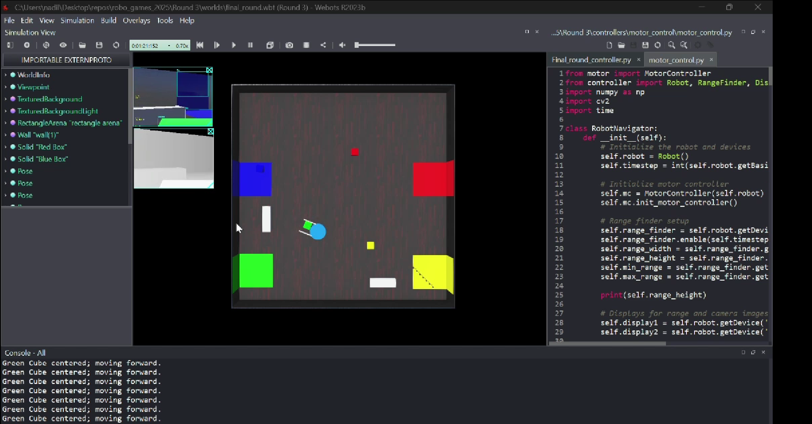

# 📦 Round 3 – RoboGames 2024 University Category (Final Round)

This directory contains the code and simulation setup for **Round 3 (Final Round)** of RoboGames 2024 University Category. In this round, the challenge is to program a **Kobuki Robot** to locate and place colored cubes in a specified order.

## 🧠 Task Description

**Scenario:**  
A set of colored cubes has been scattered across the arena. The robot must autonomously detect, collect, and place these cubes in the designated placement area following a specific order provided by the organizers.

## 🎯 Objectives

- Use the **Kobuki Robot** to:
  1. Detect and locate cubes of different colors: 🔵 Blue, 🔴 Red, 🟢 Green, 🟡 Yellow
  2. Navigate to each cube and pick it up
  3. Transport the cube to the **placement area**
  4. Place each cube in the **correct order** specified by the organizers

- The robot must complete the full task **autonomously**, demonstrating proper control, perception, and navigation.

## Simulation

